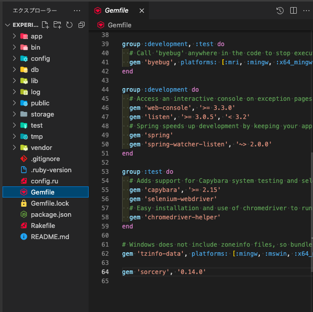
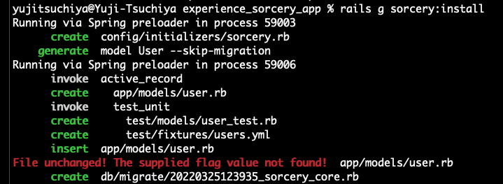
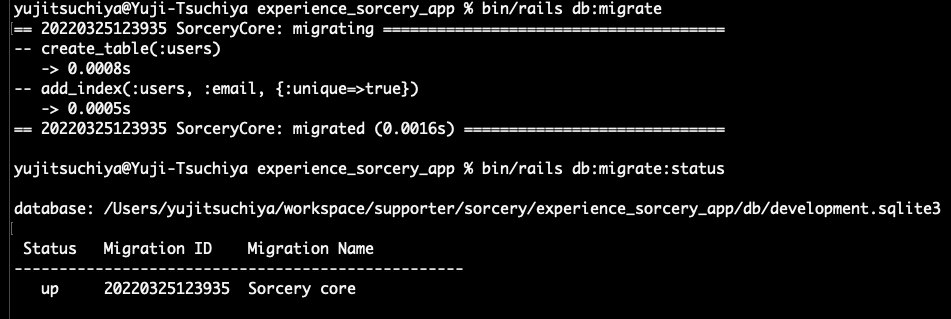
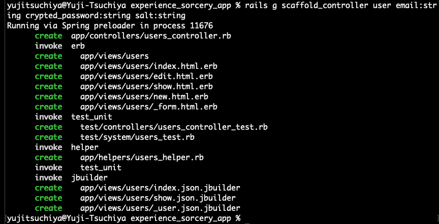
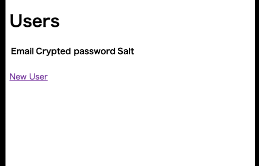
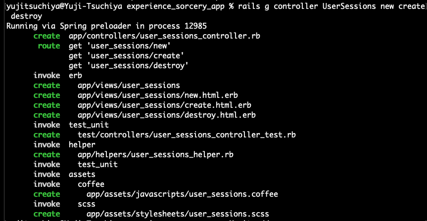
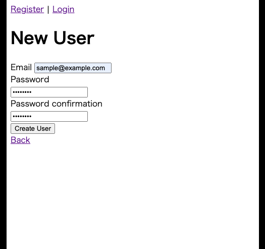
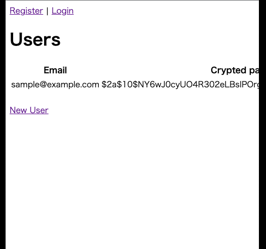
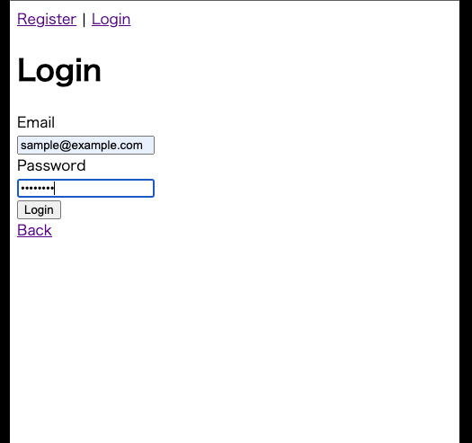
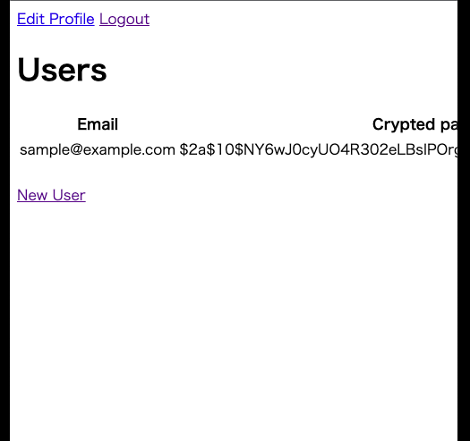

# gem 'sorcery'を体験しよう（何事も試してみる！！）

## 概要

初めてgem 'sorcery'を使用して、ユーザー登録・ログイン機能を実装することは大変かと思います。


今回は以下のRubyバージョン、Ruby on Railsのバージョンを使って`rails new`した状態(本アプリをクローンした状態)から、sorceryの[GitHub(Simple Password Authentication)](https://github.com/Sorcery/sorcery/wiki/Simple-Password-Authentication)に沿って簡単なパスワード認証に取り組んでみましょう！

---

## セットアップ

Ruby：2.6.4

Rails；5.2.3

Node.js：15.14.0 以上

```bash
$ git clone git@github.com:runteq/experience_sorcery_app.git
$ cd experience_sorcery_app
$ git remote rm origin
$ git checkout -b challenge_sorcery
$ rbenv local 2.6.4
$ bundle install
$ bin/rails s
```

サーバーを立ち上げて`http://localhost:3000`にアクセスして、「Yay!You're on Rails!」が表示されたらセットアップ完了です。


---

## Gemfileの編集

まずはGemfileに`gem 'sorcery', '0.14.0'`を加筆して、`bundle install`を実行しましょう。



```bash
$ bundle install
```

---

## sorceryで追加されたジェネレータを実行

次にGitHubに記載されているとおりに以下のコマンドを実行しましょう。

```bash
$ rails g sorcery:install
```



以下のファイルが生成されていますね。

- config/initializers/sorcery.rb
- app/models/user.rb
- test/models/user_test.rb
- test/fixtures/users.yml
- db/migrate/20xxxxxxxxx_sorcery_core.rb

上記のファイルの内、test関係以外の３ファイルの中身をざっと確認しておきましょう。

以下の記載はdb/migrate/xxxxxxxxxxxxx_sorcery_core.rbの記載です。（xxxxは作った時の日付が入ります。どんなことが書かれているのか不明瞭な場合は、[Railsガイド](https://railsguides.jp/active_record_migrations.html)や [Railsドキュメント](https://railsdoc.com/migration)等を参考にしてみましょう）

```ruby
class SorceryCore < ActiveRecord::Migration[5.2]
  def change
    create_table :users do |t|
      t.string :email,            null: false
      t.string :crypted_password
      t.string :salt

      t.timestamps                null: false
    end

    add_index :users, :email, unique: true
  end
end
```

GitHubでは`rake db:migrate`と記載されていますが、以下のコマンドで生成されたマイグレーションファイルをDBに適応させましょう。

```bash
$ bin/rails db:migrate
$ bin/rails db:migrate:status
```



---

## scaffold_controllerを使って整える

引き続きGitHubに沿って進めていきましょう。以下のscaffold_controllerを使用して、今回使用するコントローラー・ビューを用意します。（scaffold_controllerに関して不明瞭な場合は。[Railsドキュメント](https://railsdoc.com/page/rails_scaffold_controller)を参照してみましょう）

```bash
$ rails g scaffold_controller user email:string crypted_password:string salt:string
```



以降は[GitHub](https://github.com/Sorcery/sorcery/wiki/Simple-Password-Authentication#:~:text=rails%20g%20scaffold_controller%20user%20email%3Astring%20crypted_password%3Astring%20salt%3Astring)に沿って記載を加えていきましょう。

上記のリンク先の以下の記載から
>We don't want users to edit/view their crypted password or salt, so we'll remove these from all templates in app/views/users/.

こちらの記載まで取り組んでみましょう！
>Now run the app and create a new user at http://0.0.0.0:3000/users. Voila! The password was automatically encrypted, and a salt was also auto-created! By default the encryption algorithm used is BCrypt (using the bcrypt-ruby gem) but that can be configured, as well as the salt, and the database field names.

サーバーを起動して[http://localhost:3000/users/](http://localhost:3000/users/)にアクセスした際に以下の画像が表示できていればOKです！

```bash
$ bin/rails s
```



---

## UserSessionsControllerの作成

続いて[こちらのコマンド](https://github.com/Sorcery/sorcery/wiki/Simple-Password-Authentication#:~:text=rails%20g%20controller%20UserSessions%20new%20create%20destroy)からSimple Password Authenticationの最後まで取り組みます。

```bash
$ rails g controller UserSessions new create destroy
```



上記コマンド以降は[GitHub](https://github.com/Sorcery/sorcery/wiki/Simple-Password-Authentication#:~:text=Make%20it%20look%20like%20this%3A)に沿って記載を加えていきましょう。


＊これでコードの記載は終了です。不安な方は[見本のコード](https://github.com/Tsuchiya2/experience_sorcery_app/pull/1/files)を用意しておりますので、そちらを参照してください。

---

## ブラウザでユーザー登録〜ログインまで

サーバーを立ち上げて[http://localhost:3000/](http://localhost:3000/)にアクセスしてみましょう。


`New User`からEmail, Password, Password confirmationに値を入力して`Create User`をクリックしましょう。



app/views/layouts/application.html.erbの記載を見ると、ログインしているかどうかで表示を切り替えていることが分かるかと思います。

```erb
# app/views/layouts/application.html.erb

<body>
  <div id="nav">
    <% if current_user %>
      <%= link_to "Edit Profile", edit_user_path(current_user.id) %>
      <%= link_to "Logout", :logout, method: :post %>
    <% else %>
      <%= link_to "Register", new_user_path %> |
      <%= link_to "Login", :login %>
    <% end %>
  </div>
  <div>
    <p id="notice"><%= flash[:notice] %></p>
    <p id="alert"><%= flash[:alert] %></p>
  </div>
  <%= yield %>
</body>
```

`Login`から先程登録したemail, passwordを入力して`Login`しましょう。先程の部分が`Edit Profile`, `Logout`に切り替わっているかと思います。







---

## 最後に

以上、[Simple Password Authentication](https://github.com/Sorcery/sorcery/wiki/Simple-Password-Authentication)でしたが、いかがでしたでしょうか？

Rails実践 基礎編カリキュラムのsorcery部分はよく躓いてしまう箇所なので、今回の機会がsorceryのイメージを掴む助けになれば嬉しいです！🐱🐾

>＊この手順を行えばカリキュラムや課題をクリアできるわけではありませんので、適宜何が必要なのか、何が不要なのか等々を考えながら取り組んでみましょう！！
